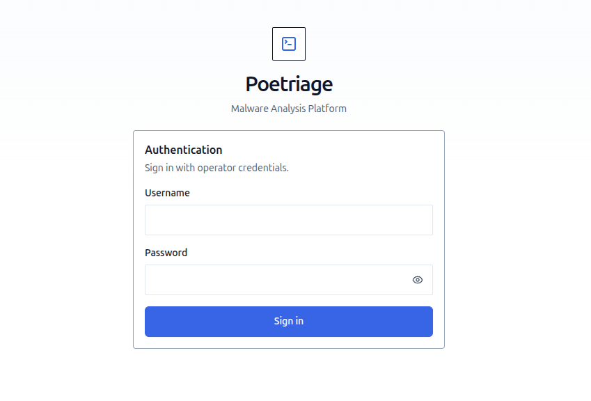
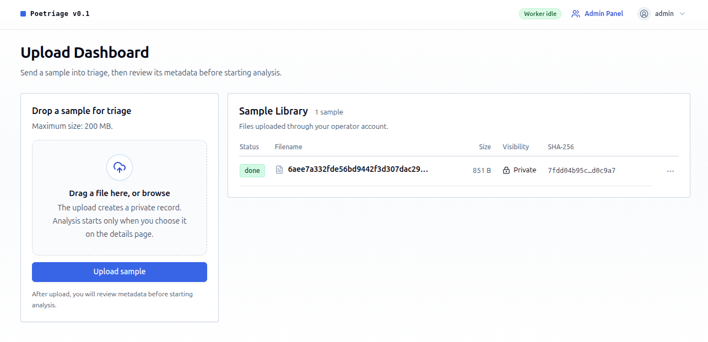
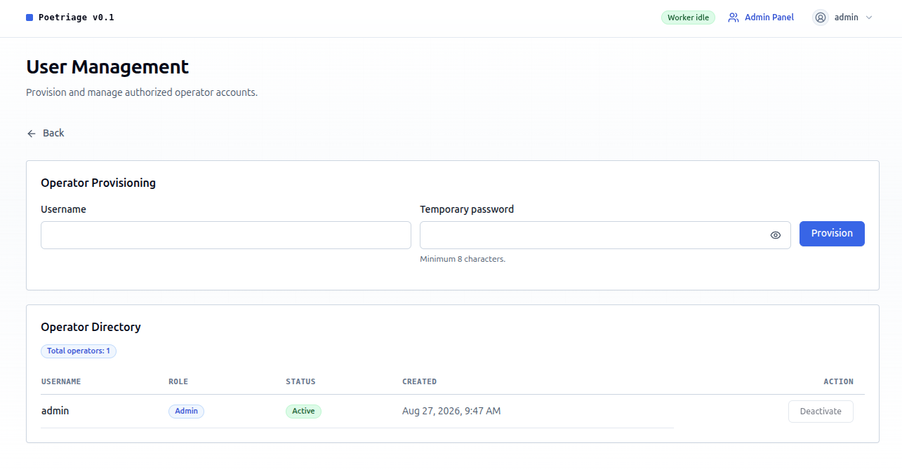

# Poetriage

Poetriage is a highly configurable, on-prem enabled LLM orchestrated **Malware Analysis** tool, packaged with a nice UI. 


## NOTE: This product is still in early development.
The happy userflows have been tested to work, but bugs may arise. 

API changes may and will happen.

If you would be so kind to report them as they pop up, I would be more than happy to fix them!


## Mission

Good sandboxes can get costly, and Malware Analysis on them can be flaky -- malware writers try to constantly dodge automated analysis tools to go "undetected."

Poetriage aims to give assistance in incident response workflows by giving a look at "what this file is" using LLMs. Using an LLM gives the analysis well needed flexibility, and one of the main ideas around Poetriage is enabling automation integrations. When an analyst looks at the ticket with a "suspicious file" included, analysis could have already run in the background, giving a good summarization to the operator of what they're potentially looking at, and if and where they should dig deeper.

Poetriage can also be run completely locally, on premises. If you serve your own model/inference, data never leaves your servers. 

During testing, cost and time per analysis was between 2 - 10 cents USD, and 5 - 20 mins per file, depending on size.

## Installation

Plug in your keys & endpoints into .env. **After the first load, the database is the source of truth, and .env changes will not override the database** as long as it exists.

Deploying with docker:
```sh
cp .env.md .env

# Edit PI_OPENROUTER_API_KEY and PI_MODEL in .env.
docker compose up --build
```

Deploying locally:
```sh
# Install the tool tool
cd pi-report-tool
npm install --omit=dev

# Install dependencies for Python
python3 -m pip install -r requirements.txt #--break-system-packages if needed

# Running API
python3 -m api.app

# Running worker
python3 analysis_worker.py
```

You will also need to run & install the docker container for Remnux, and install its MCP.

Container:
```
remnux/remnux-distro@sha256:5198184099fb433631998f6a42799a823d9af60cebfcb84895f5c151f91956bc
```
Name it remnux-pi.

MCP:
```
npm install -g @remnux/mcp-server@0.1.70
```

### ! Note: If you run the worker locally, it runs the agent on your machine without a sandbox.
Prefer mostly Docker, if you can.

Be especially careful with old, small models, as they may do unexpected actions on the host they're running on. Frontier models seem generally safe to use like this. 

The agentic workflows are built around the use of [Pi-agent](https://github.com/earendil-works/pi). Already have Pi configured? You can import your wanted config files to the project. Copy the config files you want to keep
(`models.json`, `settings.json`, `mcp.json`, `auth.json`) into
`data/pi-agent/`.

Don't have Pi yet? If you run Poetriage inside docker, one will be assigned to you. If you need to run it locally, install Pi, it should be launchable with `pi` for this stack to work.

## Modifying pi-config to your liking.

After the first run, Pi runtime/config files are generated under `./data/pi-agent` and sessions under `./data/pi-sessions`. You can tune them to your liking after first load.


## Usage

On first run, the admin credentials are automatically created for you. You will find them from `./data/admin_credentials.txt`.

After you've acquired the credentials, you can open the application at `http://localhost:5000`



After logging in as admin, you can already drag and drop a sample into the box seen below. You can also browse the files on your machine by clicking "upload sample"



After analysis you can open any file visible to your operator account from the dashboard. It will provide you a summary of the analysis, a risk score, what model was used and options to reanalyze if an error occurred.

To add more operator accounts, navigate to "admin panel" on the top bar, logged in as Admin. You can provision operators, enable/disable accounts, and manage allowed/default analysis models from here. **For now, the passwords can't be reset.** This will change in future.



By default the summaries are private, and tied to the operator account that uploaded the sample. You can however create a shareable, "public" link that allows you to share the summary to anyone. Viewing the public link doesn't require authentication.

## Design principles & concept

Core concept is simple: we use a REMnux container and its MCP to enable Agents to interact with unknown files.

For the harness, instead of coding our own, Pi-agent is used. This enables good customization & maintainability in future, while keeping the agentic part somewhat light weight. This enables us to explore fine tuning the harness for this exact task, further reducing costs and bettering the analysis quality.


## Test results

The setup has been tested across multiple samples to ensure the whole chain works. As we're still in beta-ish, bugs may arise.

During testing, deepseek v4 flash, GLM 5.3 flash and Ornith 1.5-9B were used. With the former two models, prices per file averaged from 2 cnt USD to 10 cnt USD, depending on size. The average analysis time seems to be roughly five to ten minutes, giving the model "an hourly wage" of ~20-36 cnt/hour, making it an appealing companion in Incident Response tasks.

**Mileage on both may vary** depending on what model you use, and the server it is being run on. 

## Contributing & feedback
If you wish to contribute, open up a pull request.

For any and all feedback (positive, negative, constructive or not) you can contact me on my socials!
